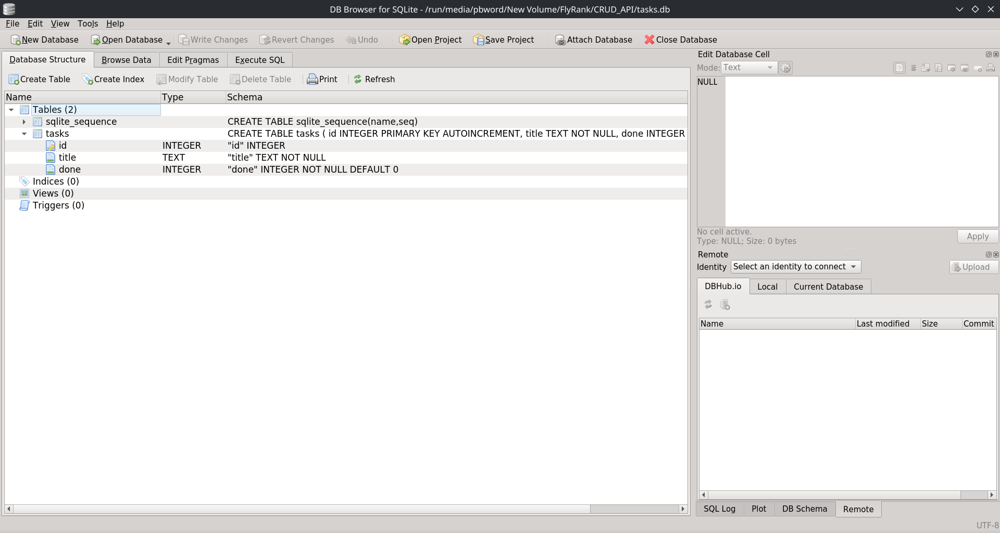

# Task API

A simple CRUD API for managing a to-do list, built with Python, FastAPI and SQLite.

## Features

- Create tasks
- Retrieve all tasks
- Retrieve a task by ID
- Update tasks
- Delete tasks
- SQLite database persistence
- Automatic database and table creation
- Automatic seeding of initial tasks
- Input validation
- Health check endpoint
- Correct HTTP status codes for all operations
- Interactive API documentation with Swagger UI

## Tech Stack

- Python 3.14+
- FastAPI
- Uvicorn
- Pydantic
- SQLite

## Setup

### 1. Clone the repository

    git clone https://github.com/pbword/task-crud-fastapi
    cd task-crud-fastapi

### 2. Create a virtual environment

    python3 -m venv .venv

### 3. Activate the virtual environment

Linux/macOS:

    source .venv/bin/activate

Windows:

    .venv\Scripts\activate

### 4. Install dependencies

    pip install -r requirements.txt

## Run the API

Start the development server with:

    python -m uvicorn main:app --reload

The API will be available at:

    http://localhost:8000

## API Documentation

FastAPI automatically generates interactive Swagger UI documentation.

Open:

    http://localhost:8000/docs

You can use Swagger UI to test all API endpoints directly from your browser.

## Endpoints

| Method | Endpoint | Description |
|--------|----------|-------------|
| GET | `/` | Get API information |
| GET | `/health` | Health check |
| GET | `/tasks` | Get all tasks |
| GET | `/tasks/{id}` | Get a task by ID |
| POST | `/tasks` | Create a new task |
| PUT | `/tasks/{id}` | Update an existing task |
| DELETE | `/tasks/{id}` | Delete an existing task |

## Example Task

    {
      "id": 1,
      "title": "Learn FastAPI",
      "done": false
    }

## Data Storage

Tasks are stored in a SQLite database named `tasks.db`.

The database and `tasks` table are created automatically when the application starts if they do not already exist.

If the database is empty, three initial tasks are automatically inserted.

The database uses the following structure:

| Column | Type | Description |
|--------|------|-------------|
| `id` | INTEGER | Primary key with auto-increment |
| `title` | TEXT | Task title |
| `done` | INTEGER | Completion status (`0` = false, `1` = true) |

The `tasks.db` file is excluded from version control through `.gitignore`. This allows each installation to create its own local database.

Data persists across API restarts because tasks are stored in SQLite rather than an in-memory Python list.

## SQLite Database

The database was inspected and modified manually using DB Browser for SQLite.

### Example SQL Query

    SELECT * FROM tasks WHERE id = 2;

The query retrieves the task with ID `2` from the SQLite database.

## Testing

The API can be tested using Swagger UI or directly from the command line with `curl`.

### Swagger UI

Open:

    http://localhost:8000/docs

### curl

Get all tasks:

    curl -i http://localhost:8000/tasks

Get a task by ID:

    curl -i http://localhost:8000/tasks/1

Create a task:

    curl -i -X POST http://localhost:8000/tasks \
      -H "Content-Type: application/json" \
      -d '{"title": "Learn FastAPI"}'

Update a task:

    curl -i -X PUT http://localhost:8000/tasks/1 \
      -H "Content-Type: application/json" \
      -d '{"done": true}'

Delete a task:

    curl -i -X DELETE http://localhost:8000/tasks/1

### Example Request

    curl -i -X POST http://localhost:8000/tasks \
      -H "Content-Type: application/json" \
      -d '{"title":"Test CRUD with curl"}'

### Example Response

    HTTP/1.1 201 Created
    content-type: application/json

    {"id":4,"title":"Test CRUD with curl","done":false}